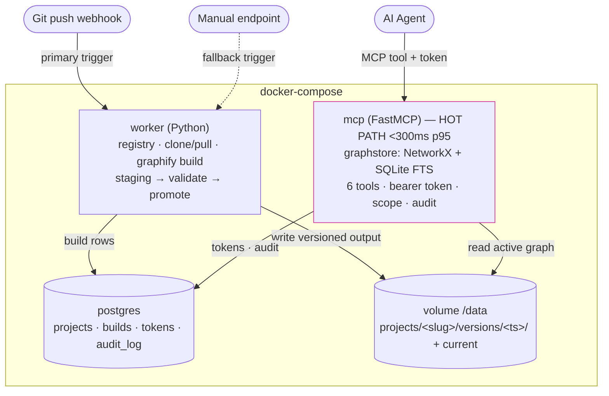
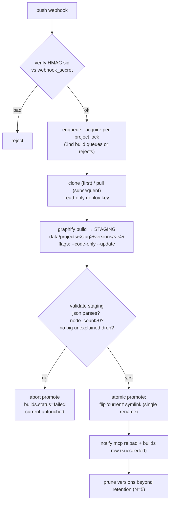
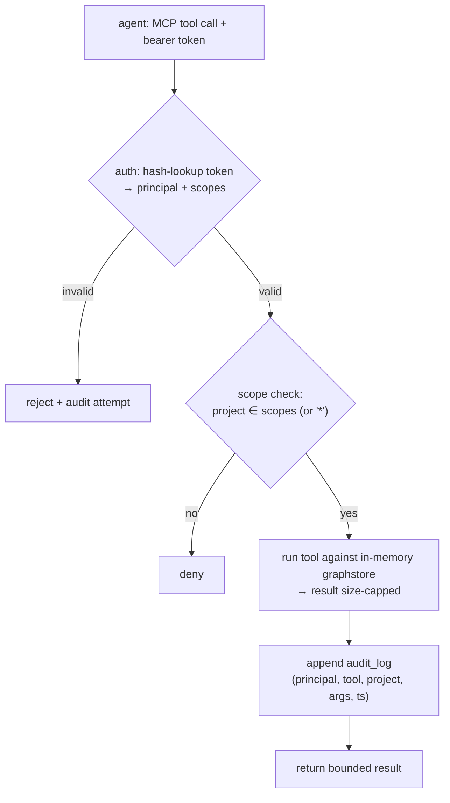
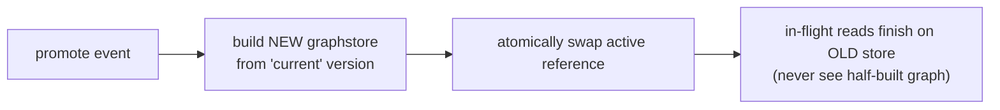

# flow.md — Architecture & Data Flow

Companion to `PRD.md` and `docs/superpowers/specs/2026-07-28-fase1-mvp-design.md`.
Scope: Fase 1 (worker + MCP + Postgres, read-only).

## Component map

**Rule:** agents reach only the MCP server. No tool returns the whole graph.

## Build path (heavy, rare — one writer per project)

Graphify lives behind `worker/graphify_adapter.py` only. Version pinned in Dockerfile.
⚠️ Headless build command (`--code-only` graph.json in CI) must be confirmed against the
pinned Graphify version — see spec §2.1.

## Query path (light, concurrent, read-only)

## Graph hot-reload

## Tools (Fase 1, deterministic — no LLM in MCP)

| Tool | What it does |
|------|--------------|
| `list_projects` | projects + last_build + node/edge counts |
| `query_graph` | FTS seed → depth-limited BFS neighborhood, capped `max_nodes` → subgraph + deterministic summary |
| `get_node` | node detail + direct edges |
| `trace_path` | shortest path(s), per-edge relation + confidence + explanation |
| `blast_radius` | reverse-reachability within depth, ranked by cached betweenness centrality |
| `search` | SQLite FTS; no `project` = cross-project, intersected with token scopes |

`add_annotation` = Fase 3, not in Fase 1.

## Storage split

| Kind | Source | Where | Lifecycle |
|------|--------|-------|-----------|
| Derived | Graphify | volume `data/projects/<slug>/versions/<ts>/` + `current` symlink | rebuildable, overwritten, retained N=5 |
| Metadata | platform | Postgres (projects, builds, tokens, audit_log) | durable |
| FTS index | derived from graph | SQLite, in mcp | ephemeral, rebuilt per graph load |
| Contributed | humans/agents | Postgres `annotations` (Fase 3, table stubbed now) | durable, overlaid at query time |

Edge confidence tags `EXTRACTED | INFERRED | AMBIGUOUS` are preserved through every layer.
