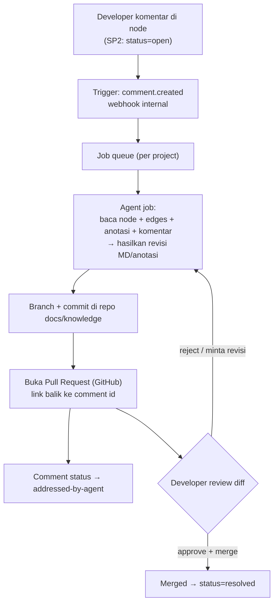

# SP3 — Feedback Loop (comment → agent → PR → approval)

**Status:** Explainer / pre-design (not built)
**Phase:** Fase 3 (final piece)
**Depends on:** SP1 (annotations/CONTRIBUTED) ✅, SP2 (comments + thread status) ✅
**PRD refs:** §9 Fase 3, §12 Q3

---

## 1. Untuk apa ini (purpose)

Menutup lingkaran antara **manusia yang menemukan masalah** di knowledge/docs dan
**agent yang memperbaikinya** — tanpa pernah membiarkan agent menulis langsung ke sumber
kebenaran.

Masalah yang dipecahkan:
- Developer baca docs sebuah node, sadar penjelasannya salah/kurang ("ini kenapa singleton?
  padahal harusnya factory"). Hari ini: dia cuma bisa komentar (SP2), lalu **mandek** — tidak
  ada yang menindaklanjuti.
- SP3 menyambungnya: komentar itu jadi **pemicu** agent bekerja, agent menghasilkan revisi,
  revisi masuk sebagai **Pull Request** yang bisa di-review manusia sebelum jadi kebenaran.

Prinsip keras PRD: **agent tidak pernah menulis tanpa review manusia. MD adalah sumber
pemahaman codebase.** Jadi output agent = PR, bukan commit langsung, bukan tulis ke
`graph.json`, bukan overwrite MD di volume.

---

## 2. Alur end-to-end

Poin kunci: **tidak ada panah dari agent langsung ke `graph.json` atau ke MD live.** Semua
lewat PR.

---

## 3. Komponen yang perlu dibangun

| Komponen | Tanggung jawab | Catatan |
|----------|----------------|---------|
| **Comment trigger** | Saat komentar dibuat (SP2), emit event `comment.created` ke antrian job | Reuse tabel `annotations`; tambah kolom job-tracking |
| **Job queue + worker** | Antrian per-project, satu job = satu komentar/thread | Bisa in-process (thread) untuk MVP, atau Postgres-backed queue |
| **Agent runner** | Panggil LLM dengan konteks (node, edges, anotasi, isi komentar) → hasilkan patch MD/anotasi | **Butuh API key + budget**; ini bagian yang mahal |
| **Git/PR adapter** | Buat branch, commit revisi, buka PR via GitHub App/token | **Butuh GitHub App / PAT + repo target** |
| **Status sync** | `open → addressed-by-agent` saat PR dibuka; `→ resolved` saat merge | Webhook PR-merged dari GitHub |
| **Diff view + approval** | Tampilkan before/after revisi agent, tombol approve | Docs app UI (Fase 2 stack) atau cukup lewat GitHub PR UI di MVP |

---

## 4. Kenapa belum dibangun (blockers nyata)

Bukan karena malas — SP3 butuh hal-hal di luar kode yang tidak bisa di-mock jujur:

1. **GitHub App / token + repo target.** PR harus dibuka ke repo asli. Perlu kredensial +
   pilihan repo + izin. Tanpa ini, "buka PR" cuma bisa dipalsukan (tidak membuktikan apa-apa).
2. **LLM agent runner + budget.** Agent yang merevisi = panggilan LLM berbiaya. Perlu keputusan
   model, prompt, dan anggaran per project.
3. **Keputusan produk (butuh brainstorm):**
   - Approval sebelum anotasi agent terlihat agent lain? (PRD open-Q3)
   - Satu komentar = satu PR, atau batch per thread/per node?
   - Siapa yang boleh memicu job (scope/role)?
   - Revisi menyentuh MD saja, atau juga anotasi `CONTRIBUTED`?

Ini XL dan butuh dekomposisi sendiri (spec → plan → build), bukan sekali jalan.

---

## 5. Yang SUDAH ada sebagai fondasi

- **SP1** — anotasi persisten + tag `CONTRIBUTED`, overlay saat query. (agent bisa baca)
- **SP2** — komentar inline + thread status `open/addressed-by-agent/resolved` +
  API worker (`POST/GET/PATCH /projects/{slug}/comments`), sudah scoped per project (IDOR fixed).
- **Notifier** (SP6) — pola best-effort webhook, bisa dipakai ulang untuk emit event.
- **Deploy-key encryption** (SP2 hardening) — pola kredensial terenkripsi, relevan untuk
  menyimpan GitHub token.

Jadi SP3 = menyambung fondasi ini dengan **agent runner** + **GitHub PR adapter** + **UI diff**.

---

## 6. Saran dekomposisi SP3 (kalau lanjut)

Pecah jadi sub-sub-project agar tiap potong bisa dites sendiri:

- **SP3a — Job trigger + queue** (murni internal, bisa dites tanpa LLM/GitHub):
  `comment.created → enqueue`, status `open→addressed-by-agent`. Fake agent runner.
- **SP3b — GitHub PR adapter** (dites dengan repo sandbox / mock GitHub API): branch, commit,
  open PR, terima webhook PR-merged → `resolved`.
- **SP3c — Agent runner** (LLM): konteks → patch. Paling mahal, butuh key + budget.
- **SP3d — Diff/approval UI** (docs app): before/after + approve. Atau lewati (pakai GitHub PR
  UI langsung) untuk MVP.

Urutan aman: **SP3a → SP3b → SP3c → SP3d**. SP3a bisa dibangun sekarang (no external deps);
SP3b/c butuh kredensial + keputusan dari kamu.

---

## 7. Yang dibutuhkan dari kamu untuk mulai

1. Repo target untuk PR (URL) + **GitHub App atau PAT** dengan izin `contents:write` +
   `pull_requests:write`.
2. **LLM backend + API key + budget** per project.
3. Jawaban 4 keputusan produk di §4.3.

Kalau mau, langkah berikut = **brainstorm SP3** (pakai skill brainstorming) untuk memfinalkan
scope, lalu tulis spec + plan seperti sub-project lain. Atau mulai **SP3a** sekarang (bagian
yang tidak butuh eksternal) sambil kredensial disiapkan.
